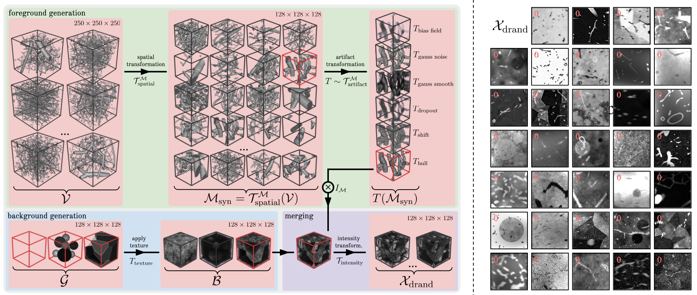

---

## Background Generation
First, create background images:

    python vesselfm/d_drand/gen_bg.py

In our experiments, we created 50,000 background images. To be specific, we created 20,000 background images with no background geometry and perlin noise (`mode_bg_geom=None`, `mode_bg_noise='perlin'`), 10,000 with polyhedrons and perlin noise (`mode_bg_geom='voronoi`, `mode_bg_noise='perlin'`), 10,000 with spheres and perlin noise (`mode_bg_geom='spheres`, `mode_bg_noise='perlin'`), and 10,000 plain images (`mode_bg_geom=None`, `mode_bg_noise='plain'`). Please set the `out_dir` and adjust `gen_bg.py` as desired (see `# TODO`).

## Data Generation
Finally, to create our domain randomized dataset $\mathcal{D}_\text{drand}$, run:

    python vesselfm/d_drand/gen_data.py

Note, to first set `OUT_DIR` (path to output dir), `DATASET_LABEL` (path to foreground geometry), and `DATASET_BACKGROUND` (path to previously generated background images) in the [config file](./config.yaml) (see `#TODO`). $\mathcal{D}_\text{drand}$ will be stored in `OUT_DIR` and contain 500,000 image-mask pairs.

The final structure of $\mathcal{D}_\text{drand}$ is as follows:
```
/path/to/d_drand   # D_drand
└── 0/   # sample 0
    └── img.npy   # domain randomized image of shape 128x128x128
    └── mask.npy  # matching label of shape 128x128x128
└── 1/
    └── img.npy 
    └── mask.npy
...

└── 499999/
    └── img.npy
    └── mask.npy
```