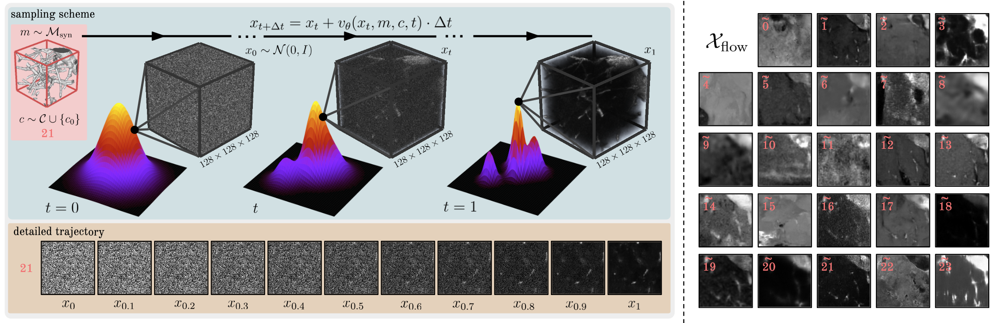

---

## Sample

    python vesselfm/d_flow/sample.py --ckpt_path /path/to/ckpt --num_samples 10000 --mask_folder /path/to/d_drand --out_folder /path/to/d_flow --production --class_cond

Please note that the class IDs do not correspond to the IDs from our manuscript but rather to the IDs from our [config file](./config.yaml) (e.g., `/path/to/d_real/MiniVess: [11, 0.04375]` -> class ID 11).

The final structure of $\mathcal{D}_\text{flow}$ is as follows:
```
/path/to/d_flow   # D_flow
└── 0/   # sample 0
    └── img_<c>.npy   # generated image of class ID c and shape 128x128x128
    └── mask_<c>.npy  # matching label of shape 128x128x128
└── 1/
    └── img_<c>.npy
    └── mask_<c>.npy
...

└── 9999/
    └── img_<c>.npy
    └── mask_<c>.npy
```

## Train

Adjust the paths in `CLASSES` to point to the previously generated datasets in the [config file](./config.yaml) (see `#TODO`) and run:

    python vesselfm/d_flow/diffusion.py
